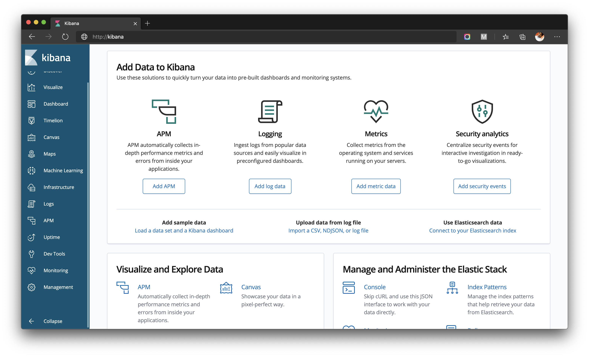

# ELK Docker-Compose  
  
## Table of Contents  
  
 - [About](#about)  
 - [Getting Started](#getting_started)  
 - [Usage](#usage)  
  
## About <a name = "about"></a>  
  
A simple arrangement of ELK stack using docker compose
  
## Getting Started <a name = "getting_started"></a>  
  
These instructions will get you a copy of the project up and running on your local machine for development and testing purposes. 
  
### Prerequisites
  
 - Docker-compose
## Usage <a name = "usage"></a>  
  
A step by step series of examples that tell you how to get a development env running.  
  
```  
$ git clone git@github.com:shemul/elastic-logstash-kibana-docker-compose.git
```   
```  
$ cd elastic-logstash-kibana-docker-compose
``` 
edit `.env` (if needed)

    ELK_VERSION=7.3.1  
    DATA_PATH=/tmp

```
$ docker-compose up
```



*it will take a while for spin up the stack, so please wait until it's boot up*

  
